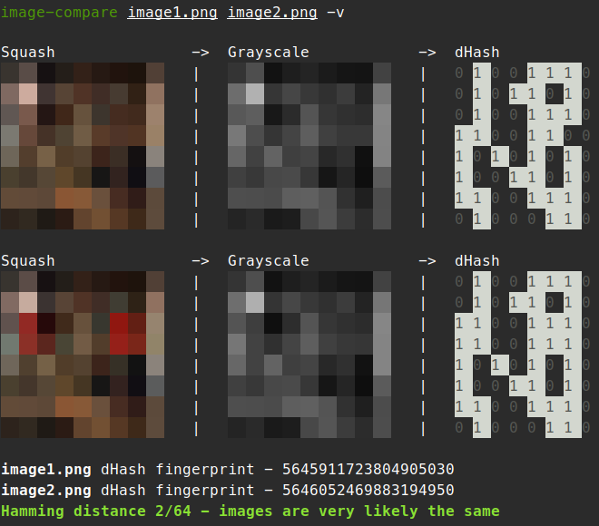

# image-compare

[](https://www.rust-lang.org)
[](https://github.com/HarrisonTCodes/image-compare/actions)
[](LICENSE)
[](https://conventionalcommits.org)

CLI Tool for comparing 2 images with hashing, calculating their similarity based on the Hamming distance between hashes.



## Install and run

To install and run the project, firstly clone it:
```bash
git clone https://github.com/HarrisonTCodes/image-compare.git
cd image-compare
```

You can then run it from the folder with:
```bash
cargo run -- --visualise path/to/image1.png path/to/image2.png
```

Or install it as a global binary so you can run it from anywhere on your machine:

```bash
cargo install --path .

# This should now work from anywhere
image-compare --visualise path/to/image1.png path/to/image2.png
```

Use the `help` flag for more information:

```bash
image-compare --help
```